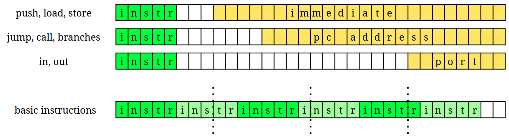
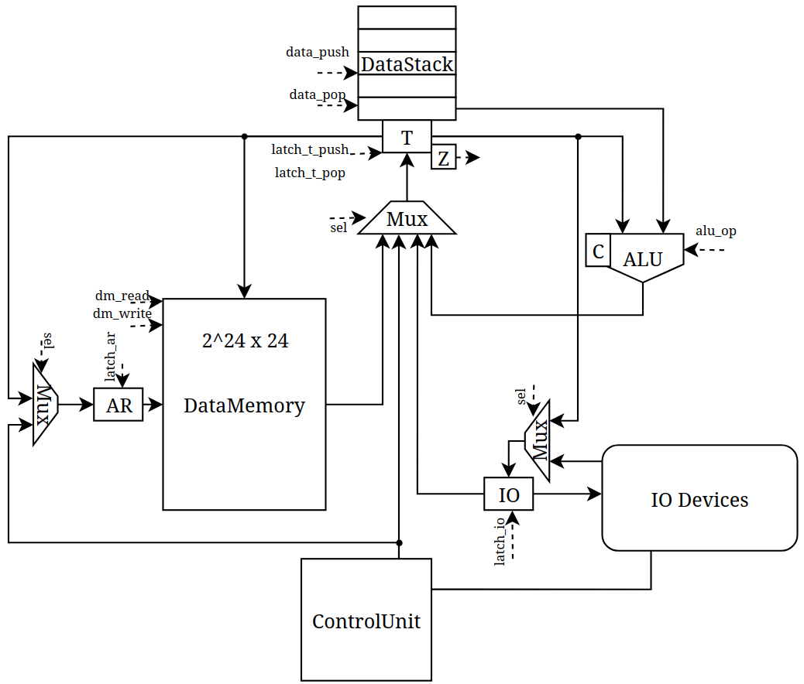
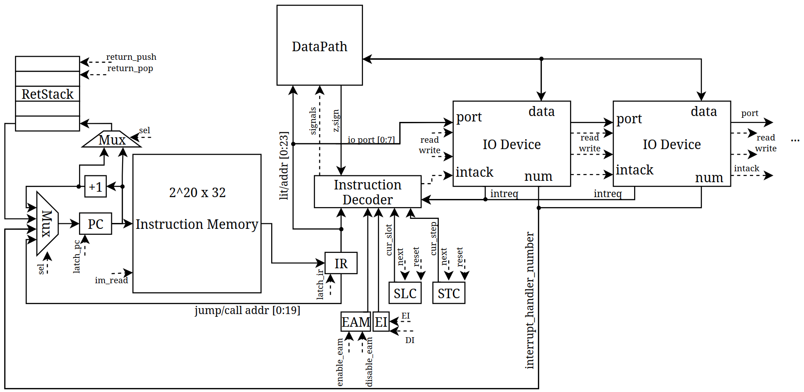

- Студент: Григорьев Илья Алексеевич, P3219.
- `lisp | stack | harv | hw | tick | binary | trap | port | cstr | prob1 | cache`

## Язык программирования

``` ebnf
<program> ::= <expression>*

<expression> ::= <literal>
               | <symbol>
               | <list-expr>
               | <function-call>
               | <special-form>

<literal>    ::= <integer> | <string>
<integer>    ::= [0-9]+
<string>     ::= '"' [^"]* '"'
<symbol>     ::= [a-zA-Z_+!*/%<>=&][a-zA-Z0-9_+!*/%<>=&-]*

<list-expr> ::= "(" <operator> <expr>* ")"
              | <special-form>
              | "(" ")"

<function-call> ::= '(' <symbol> <expression>* ')'

<special-form> ::= '(' "defun" <symbol> '(' <symbol>* ')' <expression>+ ')'
                 | '(' "setq" <symbol> <expression> ')'
                 | '(' "if" <expression> <expression> <expression>? ')'
                 | '(' "progn" <expression>+ ')'
                 | '(' "allocate" <number> ')'
                 | '(' "load-byte" <expression> ')'
                 | '(' "store-byte" <expression> <expression> ')'
                 | '(' "read-char" <number> ')'
                 | '(' "write-char" <expression> <number> ')'
                 | '(' "enable-interrupts" ')'
                 | '(' "disable-interrupts" ')'
                 | '(' "enable-eam" ')'
                 | '(' "disable-eam" ')'

<operator> ::= "+" | "-" | "*" | "*^" | "/" | "%" | "and"
             | "<" | ">=" | "=" | ">" | "<="
```

- Аппликативный порядок вычислений. Аргументы вычисляются до передачи в функцию.
- По умолчанию вычисление аргументов идёт слева направо, однако для арифметических операций `+`, `-`, `*`, `*^`, `/`, `%` аргументы вычисляются справа налево. Это сделано для оптимизации вычислений на получившейся стековой машине.
- Область видимости данных полностью глобальная: даже функции имеют доступ к любым переменным программы, нет вообще никаких ограничений видимости.
- Типизация динамическая, без явного указания типов.
- Есть поддержка целочисленных и строковых литералов.
- `allocate <size>` позволяет аллоцировать буфер фиксированного размера в памяти данных.
- `load-byte <addr>` и `store-byte <value> <addr>` позволяют работать с памятью данных по указателям.
- `read-char <port>` и `write-char <value> <port>` реализуют работу с вводом-выводом.
- `enable/disable-interrupts`, `enable/disable-eam` позволяют запрещать/разрешать прерывания, включать/выключать Extended Arithmetic Mode (учёт Carry flag в арифметических операциях).

## Организация памяти

Модель памяти процессора:

1. Память данных. Машинное слово -- 24 бита. Адреса по 24 бита. Линейное адресное пространство. Реализуется вектором знаковых чисел `i32`. Только абсолютная адресация.
2. Память команд. Машинное слово -- 32 бита. Адреса по 20 бит. Линейное адресное пространство. Только абсолютная адресация. С целью повышения плотности машинного кода машинное слово разбивается на слоты:
	- Инструкции с аргументами занимают машинное слово целиком (32 бита).
	- Инструкции без аргументов помещаются в слоты друг за другом, по 6 команд (опкод = 5 бит).
	- Если при упаковке команд в слоты встречается инструкция с агрументом, а текущее слово заполнено не до конца, оно заполняется до конца `NOP`, а инструкция помещается в начало следующего машинного слова.

Напрямую влиять программист может только на память данных, стек данных и регитр T (вершину стека). Также возможно неявное влияние на стек возврата вызовом процедур и возвратом из них.

Статические и динамические данные вместе хранятся в памяти данных без разделения на секции статических и динамических данных.

Память под статические и динамические данные выделяется во время трансляции. Транслятором предоставляется бинарный файл с аллоцированными буферами, литералами и местом под переменные.

Динамического выделения памяти нет, сборки мусора нет. Вследствие этого списки динамического размера не реализованы.

В начале памяти команд расположен безусловный переход на адрес начала программы. Между этим переходом и началом программы расположены векторы прерываний. После кода программы располагаются реализованные программистом функции, включая обработчики прерываний.

```text
       Registers
+------------------------------+
| T                            |
+------------------------------+

       Instruction memory
+------------------------------+
| 00  : jmp N                  |
|    ...                       |
| 1   : interruption vector 1  |
| 2   : interruption vector 2  |
|    ...                       |
| n   : program start          |
|    ...                       |
|     : halt                   |
| f   : function 1 body        |
|    ...                       |
| g   : function 2 body        |
|    ...                       |
+------------------------------+

          Data memory
+------------------------------+
| s   : string literal 1 start |
| s+1 : string literal 1       |
|    ...                       |
| s+n : \0                     |
|    ...                       |
| b   : buffer1[0]             |
| b+1 : buffer1[1]             |
|    ...                       |
| v   : variable 1             |
| v+1 : variable 2             |
| v+2 : variable 3             |
|    ...                       |
+------------------------------+
```

- Целочисленные литералы преобразуются в `PUSH` значения на стек данных.
- Строковые литералы располагаются в памяти данных с добавлением нуль-терминатора, а в коде преобразуются в `PUSH` адреса начала строки в памяти данных.
- Переменные отображается в загрузку значения переменной из памяти данных на стек данных.
- Есть возможность аллоцировать продолжительный отрезок памяти. Такой вызов преобразуется в загрузку адреса начала выделенного буфера на стек данных.
- В начале все процедуры сохраняют переданные им параметры в память данных, чтобы дальше по ходу выполнения обращаться с ними как с обычными переменными. Это сделано, чтобы не реализовывать сложные алгоритмы размещения аргументов на стеке перед вызовом функции и чтобы не реализовывать доступ к случайному элементу стека.
- Функции с названиями `isrX` считаются обработчиками прерываний соответствующего (X-ого) устройства.

## Система команд

Особенности процессора:
- Доступ к памяти данных осуществляется по адресу, хранящемуся в специальном регистре `AR`. Установка адреса может осуществляться по аргументу из Control Unit при инструкциях `Store`, `Load` или по значению на вершине стека данных при инструкциях `LoadIndirect`, `StoreIndirect`.
- Есть возможность запрещать и разрешать прерывания.
- Инструкции располагаются в слотах внутри машинного слова. Выбор конкретного слота с инструкцией регулируется `SLC` (slot counter).
- Значения `SLC` 1-6 соответствуют выбору одного из шести слотов в `IR`.
- При `SLC == 6` происходит защёлкивание `PC+1` в `PC` и сброс `SLC` до 0.
- При `SLC == 0` происходит защёлкивание значения из памяти инструкций в `IR` по адресу из `PC` и переключение `SLC` к состоянию 1.
- Реализована поддержка произвольного количества устройств ввода-вывода.
- Когда у устройства присутствует необработанный ввод, оно посылает сигнал `intreq` процессору.
- Если зарегистрирован сигнал `intreq`, прерывания разрешены и `SLC == 0`, происходит обработка прерывания. Процессор выставляет сигнал `intack`, которое ненужднающие в прерывании устройства пропускают насквозь, а первое нуждающееся устройство в ответ на него сбрасывает свою необходимость в прерывании и выставляет свой номер на шину обработчиков прерываний, которое в последствии защёлкивается в `PC`.

### Набор инструкций и соответствующие коды операций

- `00000` (0x0) -- `Nop` -- (1 такт) -- Ничего не делать, перейти к следующей инструкции
- `00001` (0x1) -- `Jump <addr>` -- (1 такт) -- Безусловный переход на указанный адрес
- `00010` (0x2) -- `Call <addr>` -- (1 такт) -- Вызов функции
- `00011` (0x3) -- `BranchZero <addr>` -- (1 такт) -- Переход, если текущее значение на стеке равно нулю
- `00100` (0x4) -- `BranchPositive <addr>` -- (1 такт) -- Переход, если текущее значение на стеке положительное
- `00101` (0x5) -- `Load <addr>` -- (2 такта) -- Загрузить значение из памяти данных на стек данных
- `00110` (0x6) -- `Store <addr>` -- (2 такта) -- Сохранить значение со стека данных в память данных
- `00111` (0x7) -- `Push <value>` -- (1 такт) -- Загрузка непосредственного значения на стек данных
- `01000` (0x8) -- `Return` -- (1 такт) -- Возврат из функции, переход по значению со стека возврата
- `01001` (0x9) -- `Add` -- (1 такт) -- Сложение двух чисел на стеке данных, результат возвращается на стек данных
- `01010` (0xA) -- `Sub` -- (1 такт) -- Вычитание двух чисел на стеке данных, результат возвращается на стек данных (T = T - dstack.pop())
- `01011` (0xB) -- `MultiplyHigh` -- (1 такт) -- Умножение двух чисел на стеке данных, нижняя часть результата возвращается на стек данных
- `01100` (0xC) -- `MultiplyLow` -- (1 такт) -- Умножение двух чисел на стеке данных, верхняя часть результата возвращается на стек данных
- `01101` (0xD) -- `Divide` -- (1 такт) -- Целочисленное деление двух чисел на стеке данных, результат возвращается на стек данных (T = T / dstack.pop())
- `01110` (0xE) -- `Remainder` -- (1 такт) -- Вычисления остатка при делении двух чисел на стеке данных, результат возвращается на стек данных (T = T % dstack.pop())
- `01111` (0xF) -- `Not` -- (1 такт) -- Инверсия всех битов числа на вершине стека данных
- `10000` (0x10) -- `Neg` -- (1 такт) -- Смена знака числа с вершины стека данных на противоположный
- `10001` (0x11) -- `And` -- (1 такт) -- Побитовое И двух чисел с вершины стека данных
- `10010` (0x12) -- `Xor` -- (1 такт) -- Исключающее ИЛИ двух числе с вершины стека данных
- `10011` (0x13) -- `Dup` -- (1 такт) -- Дублирование значения на вершине стека данных
- `10100` (0x14) -- `Drop` -- (1 такт) -- Удаление значения с вершины стека данных
- `10101` (0x15) -- `LoadIndirect` -- (2 такта) -- Загрузить значение из памяти данных по адресу с вершины стека данных
- `10110` (0x16) -- `StoreIndirect` -- (2 такта) -- Сохранить в память данных второе значение на стеке данных по адресу на вершине стека данных
- `10111` (0x17) -- `Out <port>` -- (2 такта) -- Вывести значение с вершины стека данных в указанное устройство ввода-вывода
- `11000` (0x18) -- `In <port>` -- (2 такта) -- Загрузить на вершину стека данных значение из указанного устройства ввода-вывода
- `11001` (0x19) -- `EnableInterrupts` -- (1 такт) -- Разрешить прерывания
- `11010` (0x1A) -- `DisableInterrupts` -- (1 такт) -- Запретить прерывания
- `11011` (0x1B) -- `EnableEam` -- (1 такт) -- Включить Extended Arithmetic Mode
- `11100` (0x1C) -- `DisableEam` -- (1 такт) -- Выключить Extended Arithmetic Mode
- `11111` (0x1F) -- `Halt` -- (1 такт) -- Остановить выполнение программы

#### Бинарное представление


## Транслятор

Интерфейс командной строки: `translator <input_file> <target_file>`

Реализовано в: [translator.rs](./src/bin/translator.rs)

Этапы трансляции (функция `compile`):

1. Трансформирование текста в последовательность значимых токенов и проверка парности скобок.
2. Парсинг синтаксического дерева из последовательности токенов.
3. Разделение обычных выражений на верхнем уровне и объявлений функций.
4. Формирование структуры итогового кода:
	- Расположение `Jmp` на старт программы.
	- Векторов прерываний.
	- Кода основной программы выражений на верхнем уровне.
	- `Halt`
	- Код объявленных функций.
5. Упаковка полученного кода по слотам машинных слов.
6. Замена меток на реальные получившиеся адреса.
7. Запись бинарных файлов с кодом и данными.

Правила генерации машинного кода:
- Вложенные структуры вычисляются рекурсивно изнутри наружу.
- Обращение к переменной преобразуется в загрузку её значения из памяти.
- Объявление переменной вызывает резервирование места под неё в памяти данных.
- Строковые литералы складываются в память данных и преобразуются в загрузку адреса начала строки.
-


## Модель процессора

Интерфейс командной строки: `machine <code.bin> <data.bin> <input-schedule> [tick-limit]`

Реализовано в [machine.rs](./src/machine.rs).

### DataPath


`data_memory` -- однопортовая память, поэтому либо читаем, либо пишем.

Сигналы (обрабатываются за один такт, реализованы в виде отдельных функций):

- `latch_ar` -- защёлкнуть выбранное значение в `AR`:
	- Из регистра T.
	- Аргумент от CU.
- `dm_write` -- записать значение из регистра T данных в память.
- `latch_t_push` -- защёлкнуть выбранное значение в регистр T:
	- Из памяти данных.
	- Аргумент от CU.
	- Из регистра IN.
	- Из ALU.
- `latch_t_pop` -- защёлкнуть в регистр T значение с вершины стека данных.
- `data_push` -- положить значение на стек данных. Все значения сдвигаются внутрь стека. На вершину стека защёлкивается значение из регистра T.
- `data_pop` -- снять начение со стека данных. Все значения сдвигаются в сторону вершины стека.
- `latch_io` -- защёлкнуть выбранное значение в регистр IO:
	- Из регистра T.
	- Из устройства ввода-вывода.

Флаги:
- `zero` -- отражает наличие нулевого значения в регистре T.
- `sign` -- отражает отрицательность значения в регистре T.

### ControlUnit


- Hardwired.
- Метод `process_tick` моделирует выполнение полного цикла инструкции (1-2 тактаа процессора).
- `STC` (step counter) необходим для многотактовых инструкций;
    - в коде реализован в виде переменной и изменяющими её сигналами.
- `SLC` (slot counter) необходим для выбора текущего слова в `IR`;
    - в коде реализован в виде переменной и изменяющими её сигналами.

Сигналы (обрабатываются за один такт, реализованы в виде отдельных функций):
- `latch_pc` -- защёлкнуть выбранное значение в `PC`:
	- `PC+1`
	- Из стека возврата
	- Из устройства ввода-вывода
	- Аргумент из `IR`
- `return_pop` -- снять начение со стека возврата. Все значения сдвигаются в сторону вершины стека.
- `return_push` -- положить значение на стек возарата. Все значения сдвигаются внутрь стека. На вершину стека защёлкивается выбранное значение:
	- `PC`
	- `PC+1`
- `latch_ir` -- защёлкнуть значение из памяти инструкций по адресу из `PC` в `IR`:
- `intack` -- сигнал предоставления прерывания устройству ввода-вывода.
- `read` -- сигнал чтения из устройства ввода-вывода. Если установлен данный сигнал и порт в `IR` совпадет с номером устройства, устройство выставляет данные на шину.
- `write` -- сигнал записи в устройство ввода-вывода. Если установлен данный сигнал и порт в `IR` совпадет с номером устройства, устройство записывает данные из `IO`.

Особенности работы модели:
- Цикл симуляции осуществляется в функции `simulate`.
- Шаг моделирования соответствует одной инструкции с выводом состояния в журнал.
- Для журнала состояний процессора используется `simplelog`.
- Количество инструкций для моделирования лимитировано.
- Остановка моделирования осуществляется при:
    - превышении лимита количества выполняемых инструкций;
    - выполнении инструкция `halt`.

## Тестирование

Тестирование выполняется при помощи golden test-ов. Реализованы в [tests/golden.rs](./tests/golden.rs)

- [tests/golden/hello.yml](tests/golden/hello.yml)
- [tests/golden/cat.yml](tests/golden/cat.yml)
- [tests/golden/hello-username.yml](tests/golden/hello-username.yml)
- [tests/golden/sort.yml](tests/golden/sort.yml)
- [tests/golden/double-arithmetics.yml](tests/golden/double-arithmetics.yml)
- [tests/golden/euler-palindrome.yml](tests/golden/euler-palindrome.yml)
- [tests/golden/factorial.yml](tests/golden/factorial.yml)
- [tests/golden/variardic.yml](tests/golden/variardic.yml)
- [tests/golden/expressions.yml](tests/golden/expressions.yml)

Запустить тесты: `cargo test --test golden`

Обновить конфигурацию golden tests:  `cargo run --bin update_golden`

Пример использования транслятора:

``` shell
$ cat examples/hello.lsp
(defun print-string (addr i)
  (if (setq c (load-byte (+ addr i)))
          (progn
                (write-char c 1)
                (print-string addr (+ i 1)))))


(setq str "Hello")
(print-string str 0)
$ cargo run --bin translator examples/hello.lsp target
$ xxd target.data.bin
00000000: 0000 4800 0065 0000 6c00 006c 0000 6f00  ..H..e..l..l..o.
00000010: 0000 0000 0000 0000 0000 0000 0000       ..............
$ xxd target.bin
00000000: 0800 0001 3800 0000 9800 0000 3000 0009  ....8.......0...
00000010: a000 0000 2800 0009 3800 0000 1000 0009  ....(...8.......
00000020: e800 0000 3000 0008 3000 0006 2800 0008  ....0...0...(...
00000030: 2800 0006 4d66 0000 3000 0007 1800 001a  (...Mf..0.......
00000040: a000 0000 2800 0007 9800 0000 b800 0001  ....(...........
00000050: a000 0000 2800 0006 3800 0001 2800 0008  ....(...8...(...
00000060: 4800 0000 0800 0009 4000 0000            H.......@...
$ cat target.bin.hex
$ cat target.bin.hex
0000 - 0x08000001 - jump("__main_start") 1
0001 - 0x38000000 - pushaddr("l0_hello") 0
0002 - 0x98000000 - dup
0003 - 0x30000009 - store("str_var") 9
0004 - 0xA0000000 - drop
0005 - 0x28000009 - load("str_var") 9
0006 - 0x38000000 - pushnum(0) 0
0007 - 0x10000009 - call("print-string") 9
0008 - 0xE8000000 - halt
0009 - 0x30000008 - store("i_var") 8
0010 - 0x30000006 - store("addr_var") 6
0011 - 0x28000008 - load("i_var") 8
0012 - 0x28000006 - load("addr_var") 6
0013 - 0x4D660000 - add | loadindirect | dup
0014 - 0x30000007 - store("c_var") 7
0015 - 0x1800001A - branchzero("l1_endif") 26
0016 - 0xA0000000 - drop
0017 - 0x28000007 - load("c_var") 7
0018 - 0x98000000 - dup
0019 - 0xB8000001 - out(1) 1
0020 - 0xA0000000 - drop
0021 - 0x28000006 - load("addr_var") 6
0022 - 0x38000001 - pushnum(1) 1
0023 - 0x28000008 - load("i_var") 8
0024 - 0x48000000 - add
0025 - 0x08000009 - jump("print-string") 9
0026 - 0x40000000 - return
```

Пример использования модели процессора:

``` shell
$ cat examples/hello.input
(100000, 0)
$ cargo run --bin machine target.bin target.data.bin examples/hello.input 1000
[INFO] 0 PC/SLOT/STEP:0/0/0 EI/EAM:0/0 Idepth:0 --- T:0 Dst:[] Rst:[] AR:0 IO:0
[INFO] 1 PC/SLOT/STEP:0/1/0 EI/EAM:0/0 Idepth:0 JUMP(1) T:0 Dst:[] Rst:[] AR:0 IO:0
[INFO] 2 PC/SLOT/STEP:1/0/0 EI/EAM:0/0 Idepth:0 --- T:0 Dst:[] Rst:[] AR:0 IO:0
[INFO] 3 PC/SLOT/STEP:1/1/0 EI/EAM:0/0 Idepth:0 PUSH(0) T:0 Dst:[] Rst:[] AR:0 IO:0
[INFO] 4 PC/SLOT/STEP:2/0/0 EI/EAM:0/0 Idepth:0 --- T:0 Dst:[0] Rst:[] AR:0 IO:0
[INFO] 5 PC/SLOT/STEP:2/1/0 EI/EAM:0/0 Idepth:0 DUP T:0 Dst:[0] Rst:[] AR:0 IO:0
[INFO] 6 PC/SLOT/STEP:2/2/0 EI/EAM:0/0 Idepth:0 NOP T:0 Dst:[0, 0] Rst:[] AR:0 IO:0
[INFO] 7 PC/SLOT/STEP:2/3/0 EI/EAM:0/0 Idepth:0 NOP T:0 Dst:[0, 0] Rst:[] AR:0 IO:0
[INFO] 8 PC/SLOT/STEP:2/4/0 EI/EAM:0/0 Idepth:0 NOP T:0 Dst:[0, 0] Rst:[] AR:0 IO:0
[INFO] 9 PC/SLOT/STEP:2/5/0 EI/EAM:0/0 Idepth:0 NOP T:0 Dst:[0, 0] Rst:[] AR:0 IO:0
[INFO] 10 PC/SLOT/STEP:2/6/0 EI/EAM:0/0 Idepth:0 NOP T:0 Dst:[0, 0] Rst:[] AR:0 IO:0
[INFO] 11 PC/SLOT/STEP:3/0/0 EI/EAM:0/0 Idepth:0 --- T:0 Dst:[0, 0] Rst:[] AR:0 IO:0
[INFO] 12 PC/SLOT/STEP:3/1/0 EI/EAM:0/0 Idepth:0 ST(9) T:0 Dst:[0, 0] Rst:[] AR:0 IO:0
[INFO] 13 PC/SLOT/STEP:3/1/1 EI/EAM:0/0 Idepth:0 ST(9) T:0 Dst:[0, 0] Rst:[] AR:9 IO:0
[INFO] 14 PC/SLOT/STEP:4/0/0 EI/EAM:0/0 Idepth:0 --- T:0 Dst:[0] Rst:[] AR:9 IO:0
[INFO] 15 PC/SLOT/STEP:4/1/0 EI/EAM:0/0 Idepth:0 DROP T:0 Dst:[0] Rst:[] AR:9 IO:0
[INFO] 16 PC/SLOT/STEP:4/2/0 EI/EAM:0/0 Idepth:0 NOP T:0 Dst:[] Rst:[] AR:9 IO:0
[INFO] 17 PC/SLOT/STEP:4/3/0 EI/EAM:0/0 Idepth:0 NOP T:0 Dst:[] Rst:[] AR:9 IO:0
[INFO] 18 PC/SLOT/STEP:4/4/0 EI/EAM:0/0 Idepth:0 NOP T:0 Dst:[] Rst:[] AR:9 IO:0
[INFO] 19 PC/SLOT/STEP:4/5/0 EI/EAM:0/0 Idepth:0 NOP T:0 Dst:[] Rst:[] AR:9 IO:0
[INFO] 20 PC/SLOT/STEP:4/6/0 EI/EAM:0/0 Idepth:0 NOP T:0 Dst:[] Rst:[] AR:9 IO:0
[INFO] 21 PC/SLOT/STEP:5/0/0 EI/EAM:0/0 Idepth:0 --- T:0 Dst:[] Rst:[] AR:9 IO:0
[INFO] 22 PC/SLOT/STEP:5/1/0 EI/EAM:0/0 Idepth:0 LD(9) T:0 Dst:[] Rst:[] AR:9 IO:0
[INFO] 23 PC/SLOT/STEP:5/1/1 EI/EAM:0/0 Idepth:0 LD(9) T:0 Dst:[] Rst:[] AR:9 IO:0
[INFO] 24 PC/SLOT/STEP:6/0/0 EI/EAM:0/0 Idepth:0 --- T:0 Dst:[0] Rst:[] AR:9 IO:0
[INFO] 25 PC/SLOT/STEP:6/1/0 EI/EAM:0/0 Idepth:0 PUSH(0) T:0 Dst:[0] Rst:[] AR:9 IO:0
[INFO] 26 PC/SLOT/STEP:7/0/0 EI/EAM:0/0 Idepth:0 --- T:0 Dst:[0, 0] Rst:[] AR:9 IO:0
[INFO] 27 PC/SLOT/STEP:7/1/0 EI/EAM:0/0 Idepth:0 CALL(9) T:0 Dst:[0, 0] Rst:[] AR:9 IO:0
[INFO] 28 PC/SLOT/STEP:9/0/0 EI/EAM:0/0 Idepth:0 --- T:0 Dst:[0, 0] Rst:[8] AR:9 IO:0
[INFO] 29 PC/SLOT/STEP:9/1/0 EI/EAM:0/0 Idepth:0 ST(8) T:0 Dst:[0, 0] Rst:[8] AR:9 IO:0
[INFO] 30 PC/SLOT/STEP:9/1/1 EI/EAM:0/0 Idepth:0 ST(8) T:0 Dst:[0, 0] Rst:[8] AR:8 IO:0
[INFO] 31 PC/SLOT/STEP:10/0/0 EI/EAM:0/0 Idepth:0 --- T:0 Dst:[0] Rst:[8] AR:8 IO:0
[INFO] 32 PC/SLOT/STEP:10/1/0 EI/EAM:0/0 Idepth:0 ST(6) T:0 Dst:[0] Rst:[8] AR:8 IO:0
[INFO] 33 PC/SLOT/STEP:10/1/1 EI/EAM:0/0 Idepth:0 ST(6) T:0 Dst:[0] Rst:[8] AR:6 IO:0
[INFO] 34 PC/SLOT/STEP:11/0/0 EI/EAM:0/0 Idepth:0 --- T:0 Dst:[] Rst:[8] AR:6 IO:0
[INFO] 35 PC/SLOT/STEP:11/1/0 EI/EAM:0/0 Idepth:0 LD(8) T:0 Dst:[] Rst:[8] AR:6 IO:0
[INFO] 36 PC/SLOT/STEP:11/1/1 EI/EAM:0/0 Idepth:0 LD(8) T:0 Dst:[] Rst:[8] AR:8 IO:0
[INFO] 37 PC/SLOT/STEP:12/0/0 EI/EAM:0/0 Idepth:0 --- T:0 Dst:[0] Rst:[8] AR:8 IO:0
[INFO] 38 PC/SLOT/STEP:12/1/0 EI/EAM:0/0 Idepth:0 LD(6) T:0 Dst:[0] Rst:[8] AR:8 IO:0
[INFO] 39 PC/SLOT/STEP:12/1/1 EI/EAM:0/0 Idepth:0 LD(6) T:0 Dst:[0] Rst:[8] AR:6 IO:0
[INFO] 40 PC/SLOT/STEP:13/0/0 EI/EAM:0/0 Idepth:0 --- T:0 Dst:[0, 0] Rst:[8] AR:6 IO:0
[INFO] 41 PC/SLOT/STEP:13/1/0 EI/EAM:0/0 Idepth:0 ADD T:0 Dst:[0, 0] Rst:[8] AR:6 IO:0
[INFO] 42 PC/SLOT/STEP:13/2/0 EI/EAM:0/0 Idepth:0 LDI T:0 Dst:[0] Rst:[8] AR:6 IO:0
[INFO] 43 PC/SLOT/STEP:13/2/1 EI/EAM:0/0 Idepth:0 LDI T:0 Dst:[] Rst:[8] AR:0 IO:0
[INFO] 44 PC/SLOT/STEP:13/3/0 EI/EAM:0/0 Idepth:0 DUP T:72 Dst:[0] Rst:[8] AR:0 IO:0
[INFO] 45 PC/SLOT/STEP:13/4/0 EI/EAM:0/0 Idepth:0 NOP T:72 Dst:[0, 72] Rst:[8] AR:0 IO:0
[INFO] 46 PC/SLOT/STEP:13/5/0 EI/EAM:0/0 Idepth:0 NOP T:72 Dst:[0, 72] Rst:[8] AR:0 IO:0
[INFO] 47 PC/SLOT/STEP:13/6/0 EI/EAM:0/0 Idepth:0 NOP T:72 Dst:[0, 72] Rst:[8] AR:0 IO:0
[INFO] 48 PC/SLOT/STEP:14/0/0 EI/EAM:0/0 Idepth:0 --- T:72 Dst:[0, 72] Rst:[8] AR:0 IO:0
[INFO] 49 PC/SLOT/STEP:14/1/0 EI/EAM:0/0 Idepth:0 ST(7) T:72 Dst:[0, 72] Rst:[8] AR:0 IO:0
[INFO] 50 PC/SLOT/STEP:14/1/1 EI/EAM:0/0 Idepth:0 ST(7) T:72 Dst:[0, 72] Rst:[8] AR:7 IO:0
[INFO] 51 PC/SLOT/STEP:15/0/0 EI/EAM:0/0 Idepth:0 --- T:72 Dst:[0] Rst:[8] AR:7 IO:0
[INFO] 52 PC/SLOT/STEP:15/1/0 EI/EAM:0/0 Idepth:0 BZ(26) T:72 Dst:[0] Rst:[8] AR:7 IO:0
[INFO] 53 PC/SLOT/STEP:16/0/0 EI/EAM:0/0 Idepth:0 --- T:72 Dst:[0] Rst:[8] AR:7 IO:0
[INFO] 54 PC/SLOT/STEP:16/1/0 EI/EAM:0/0 Idepth:0 DROP T:72 Dst:[0] Rst:[8] AR:7 IO:0
[INFO] 55 PC/SLOT/STEP:16/2/0 EI/EAM:0/0 Idepth:0 NOP T:0 Dst:[] Rst:[8] AR:7 IO:0
[INFO] 56 PC/SLOT/STEP:16/3/0 EI/EAM:0/0 Idepth:0 NOP T:0 Dst:[] Rst:[8] AR:7 IO:0
[INFO] 57 PC/SLOT/STEP:16/4/0 EI/EAM:0/0 Idepth:0 NOP T:0 Dst:[] Rst:[8] AR:7 IO:0
[INFO] 58 PC/SLOT/STEP:16/5/0 EI/EAM:0/0 Idepth:0 NOP T:0 Dst:[] Rst:[8] AR:7 IO:0
[INFO] 59 PC/SLOT/STEP:16/6/0 EI/EAM:0/0 Idepth:0 NOP T:0 Dst:[] Rst:[8] AR:7 IO:0
[INFO] 60 PC/SLOT/STEP:17/0/0 EI/EAM:0/0 Idepth:0 --- T:0 Dst:[] Rst:[8] AR:7 IO:0
[INFO] 61 PC/SLOT/STEP:17/1/0 EI/EAM:0/0 Idepth:0 LD(7) T:0 Dst:[] Rst:[8] AR:7 IO:0
[INFO] 62 PC/SLOT/STEP:17/1/1 EI/EAM:0/0 Idepth:0 LD(7) T:0 Dst:[] Rst:[8] AR:7 IO:0
...
[INFO] 380 PC/SLOT/STEP:11/1/0 EI/EAM:0/0 Idepth:0 LD(8) T:0 Dst:[] Rst:[8] AR:6 IO:111
[INFO] 381 PC/SLOT/STEP:11/1/1 EI/EAM:0/0 Idepth:0 LD(8) T:0 Dst:[] Rst:[8] AR:8 IO:111
[INFO] 382 PC/SLOT/STEP:12/0/0 EI/EAM:0/0 Idepth:0 --- T:5 Dst:[0] Rst:[8] AR:8 IO:111
[INFO] 383 PC/SLOT/STEP:12/1/0 EI/EAM:0/0 Idepth:0 LD(6) T:5 Dst:[0] Rst:[8] AR:8 IO:111
[INFO] 384 PC/SLOT/STEP:12/1/1 EI/EAM:0/0 Idepth:0 LD(6) T:5 Dst:[0] Rst:[8] AR:6 IO:111
[INFO] 385 PC/SLOT/STEP:13/0/0 EI/EAM:0/0 Idepth:0 --- T:0 Dst:[0, 5] Rst:[8] AR:6 IO:111
[INFO] 386 PC/SLOT/STEP:13/1/0 EI/EAM:0/0 Idepth:0 ADD T:0 Dst:[0, 5] Rst:[8] AR:6 IO:111
[INFO] 387 PC/SLOT/STEP:13/2/0 EI/EAM:0/0 Idepth:0 LDI T:5 Dst:[0] Rst:[8] AR:6 IO:111
[INFO] 388 PC/SLOT/STEP:13/2/1 EI/EAM:0/0 Idepth:0 LDI T:0 Dst:[] Rst:[8] AR:5 IO:111
[INFO] 389 PC/SLOT/STEP:13/3/0 EI/EAM:0/0 Idepth:0 DUP T:0 Dst:[0] Rst:[8] AR:5 IO:111
[INFO] 390 PC/SLOT/STEP:13/4/0 EI/EAM:0/0 Idepth:0 NOP T:0 Dst:[0, 0] Rst:[8] AR:5 IO:111
[INFO] 391 PC/SLOT/STEP:13/5/0 EI/EAM:0/0 Idepth:0 NOP T:0 Dst:[0, 0] Rst:[8] AR:5 IO:111
[INFO] 392 PC/SLOT/STEP:13/6/0 EI/EAM:0/0 Idepth:0 NOP T:0 Dst:[0, 0] Rst:[8] AR:5 IO:111
[INFO] 393 PC/SLOT/STEP:14/0/0 EI/EAM:0/0 Idepth:0 --- T:0 Dst:[0, 0] Rst:[8] AR:5 IO:111
[INFO] 394 PC/SLOT/STEP:14/1/0 EI/EAM:0/0 Idepth:0 ST(7) T:0 Dst:[0, 0] Rst:[8] AR:5 IO:111
[INFO] 395 PC/SLOT/STEP:14/1/1 EI/EAM:0/0 Idepth:0 ST(7) T:0 Dst:[0, 0] Rst:[8] AR:7 IO:111
[INFO] 396 PC/SLOT/STEP:15/0/0 EI/EAM:0/0 Idepth:0 --- T:0 Dst:[0] Rst:[8] AR:7 IO:111
[INFO] 397 PC/SLOT/STEP:15/1/0 EI/EAM:0/0 Idepth:0 BZ(26) T:0 Dst:[0] Rst:[8] AR:7 IO:111
[INFO] 398 PC/SLOT/STEP:26/0/0 EI/EAM:0/0 Idepth:0 --- T:0 Dst:[0] Rst:[8] AR:7 IO:111
[INFO] 399 PC/SLOT/STEP:26/1/0 EI/EAM:0/0 Idepth:0 RET T:0 Dst:[0] Rst:[8] AR:7 IO:111
[INFO] 400 PC/SLOT/STEP:8/0/0 EI/EAM:0/0 Idepth:0 --- T:0 Dst:[0] Rst:[] AR:7 IO:111
[INFO] 401 PC/SLOT/STEP:8/1/0 EI/EAM:0/0 Idepth:0 HALT T:0 Dst:[0] Rst:[] AR:7 IO:111
IO1: [72(H), 101(e), 108(l), 108(l), 111(o)]
ticks: 401
```
